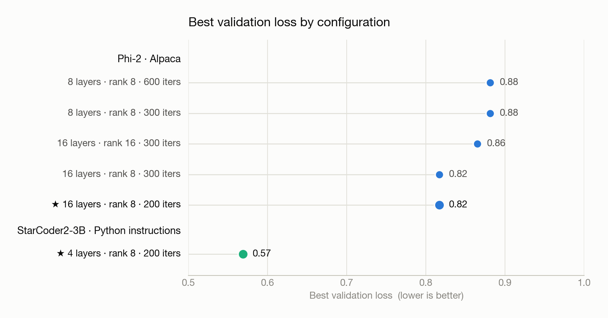
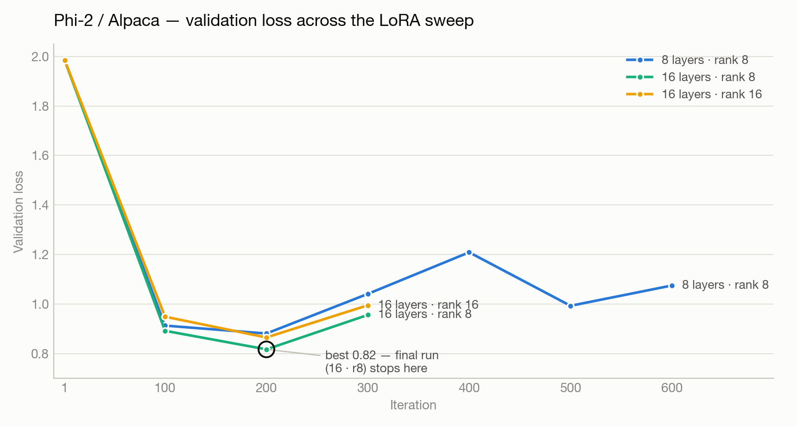

# ml-experiment

LoRA fine-tuning of small open-weight LLMs (Phi-2, StarCoder2-3B) on instruction datasets, running locally with Apple's MLX framework. The project covers the full loop: data prep, training, hyperparameter sweep, loss visualization, and side-by-side base vs. fine-tuned evaluation.

## Hardware & stack

- **Hardware:** M4 MacBook Pro, 16 GB unified memory
- **Python:** 3.11 (arm64 native)
- **Frameworks:** [MLX](https://github.com/ml-explore/mlx) + [mlx-lm](https://github.com/ml-explore/mlx-lm), HuggingFace `datasets` / `transformers` / `huggingface-hub`, `matplotlib`

## What this project demonstrates

- **LoRA fine-tuning** on consumer Apple Silicon — adapter-only training that fits a 2.7B-parameter model in 16 GB unified memory.
- **Hyperparameter search** over LoRA rank, layer count, and iteration budget, with loss curves preserved per run.
- **Model comparison** — generation from the base checkpoint and the LoRA-tuned checkpoint on the same prompt, in one script.
- **Reproducible runs** — every experiment writes its config and metrics into a dated folder.

## Prerequisites & installation

```bash
# clone & enter the project
cd ml-experiment

# create and activate a venv
python3.11 -m venv .venv
source .venv/bin/activate

# install dependencies
pip install -r requirements.txt
```

A HuggingFace account isn't required for the public datasets/models used here, but `huggingface-cli login` is needed if you swap in gated models.

## Usage

Run the scripts in this order:

```bash
# 1. Format the dataset → data/{train,valid,test}.jsonl + alpaca_sample.jsonl
python src/prepare_data.py

# 2. Fine-tune; adapters and metrics land in experiments/<YYYY-MM-DD-HHMM>/
python src/train.py

# 3. Plot training/validation loss for the latest run (or pin one)
python src/plot_loss.py
python src/plot_loss.py --experiment experiments/YYYY-MM-DD-HHMM

# 4. Compare base vs fine-tuned on a prompt (uses latest experiment by default)
python src/evaluate.py "Explain gradient descent in two sentences."
python src/evaluate.py --adapter experiments/YYYY-MM-DD-HHMM "Write a Python function that reverses a linked list."

# For StarCoder2 adapters, specify the base model explicitly
python src/evaluate.py --model bigcode/starcoder2-3b \
  --adapter experiments/YYYY-MM-DD-HHMM "Write a bubble sort in Python"
```

To start a new experiment, edit `configs/lora_config.json` and re-run `src/train.py` — each run gets its own dated folder.

## Experiments summary

| Model         | Dataset     | Layers | Rank | Iters | Best Val Loss |
|---------------|-------------|-------:|-----:|------:|--------------:|
| Phi-2         | Alpaca      |      8 |    8 |   600 |          0.88 |
| Phi-2         | Alpaca      |      8 |    8 |   300 |          0.88 |
| Phi-2         | Alpaca      |     16 |    8 |   300 |          0.82 |
| Phi-2         | Alpaca      |     16 |   16 |   300 |          0.86 |
| **Phi-2**     | **Alpaca**  | **16** |  **8** | **200** | **0.81 (best)** |
| **StarCoder2-3B** | **Python Code** | **4** | **8** | **200** | **0.57 (best)** |





Both charts render from the committed `metrics.csv` files: `python src/plot_comparison.py`.

## Key findings

- **More LoRA layers > more iterations.** Going from 8 → 16 trainable layers dropped Phi-2's best val loss from 0.88 to 0.81 with *fewer* iterations (200 vs. 300).
- **Rank 8 beat rank 16** at fixed layers. The higher-rank adapter (16/16) overfit faster and ended at 0.86 vs. 0.82 for 16/8 at the same iteration count.
- **Longer training hurt.** At 8 layers / rank 8, 600 iters matched the 300-iter run's best (0.88 at iteration 200), then drifted past it — val loss climbed back above 1.0 by the end of the run.
- **StarCoder2-3B** specialized cleanly on Python instructions, reaching val loss 0.57 with only 4 LoRA layers — narrower domain, sharper fit.
- **Adapter-only outputs** kept disk usage minimal (a few MB per run) compared to fusing full weights.

## Known limitations

- **16 GB memory ceiling.** Training requires `batch_size: 1`, `grad_checkpoint: true`, and capped sequence length. Anything more aggressive OOMs.
- **StarCoder2 sequences are truncated to 256 tokens.** Many real Python-instruction examples exceed this, so the model sees a clipped view of longer programs. Increasing `max_seq_length` triggers OOM on this hardware.
- **No held-out evaluation harness.** Comparison is qualitative (`evaluate.py` prints base vs. tuned generations); there are no automated benchmarks like MMLU or HumanEval wired in.
- **Single-seed runs.** Each row in the experiments table is one seed — variance across seeds isn't measured.
- **Phi-2 isn't instruction-tuned out of the box,** so the base model's responses can be noisy, which inflates the perceived gain from LoRA.

## Project structure

```
ml-experiment/
├── assets/                       # README charts (rendered by plot_comparison.py)
├── configs/
│   └── lora_config.json          # active hyperparameters for the next run
├── data/                         # generated dataset (gitignored)
├── experiments/                  # one dated folder per run
│   └── YYYY-MM-DD-HHMM/
│       ├── lora_config.json      # snapshot of the config used
│       ├── adapters.safetensors  # LoRA weights (gitignored)
│       ├── metrics.csv           # parsed train/val loss per iter (kept in git)
│       └── loss_curves.png       # rendered by plot_loss.py (kept in git)
├── notebooks/                    # exploration scratch
├── src/
│   ├── prepare_data.py           # downloads + formats the HF dataset into jsonl
│   ├── train.py                  # runs mlx-lm LoRA, parses metrics into CSV
│   ├── plot_loss.py              # renders loss curves from metrics.csv
│   ├── plot_comparison.py        # renders the cross-run README charts
│   └── evaluate.py               # base vs. fine-tuned side-by-side on a prompt
├── requirements.txt
└── CLAUDE.md                     # working notes for the AI assistant
```

## Acknowledgements

Built with assistance from Claude Code (Anthropic) for code generation and for project scaffolding. All experimental design, 
hyperparameter decisions, and analysis are my own.
